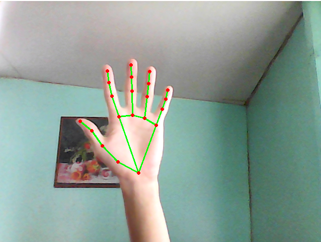
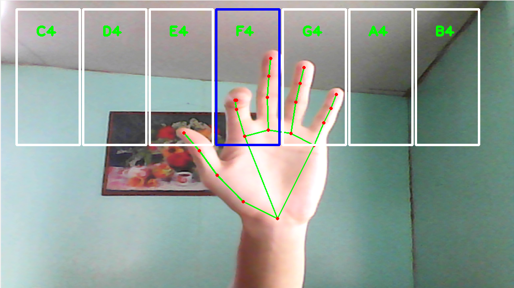

# Magic-Piano

Magic Piano is a computer vision-based project that allows you to play a virtual piano using hand recognition through a camera.

## Pipeline

### 1. Hand detection

We get a frame from the camera using Open-CV and use MediaPipe Hand Detector to recognize hands and get information about key points of the palm.



### 2. Press detection

Next, we draw the piano on frame and use the coordinates of the key points to track the keypress. When pressed, the corresponding sound is played.



### 3. Displaying

At the last stage, we display the frame on the screen of the GUI created using PyQt5


## How to use

First, you need to clone this repository to a folder that does not have Russian letters in the path.
Example:
```bash
cd C:/Users
git clone https://github.com/DumDereDum/Magic-Piano.git
```
Then, install the necessary libraries with command:
```bash
pip install -r requirements.txt
```
Go inside the folder "Magic-Piano" and run project using "nameexewecreate".exe or command:
```bash
python "namepywecreate".py
```
